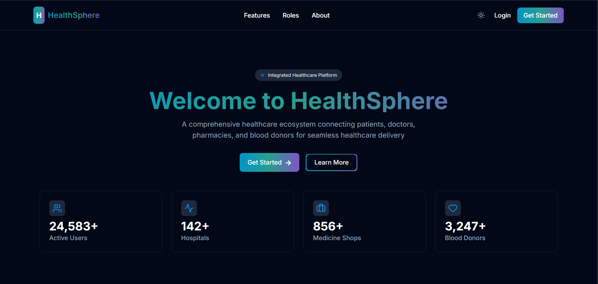
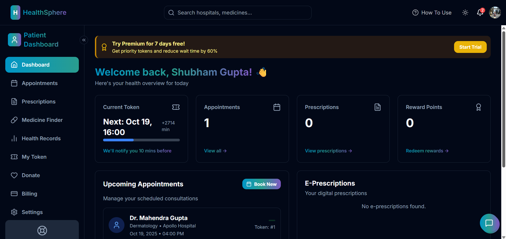
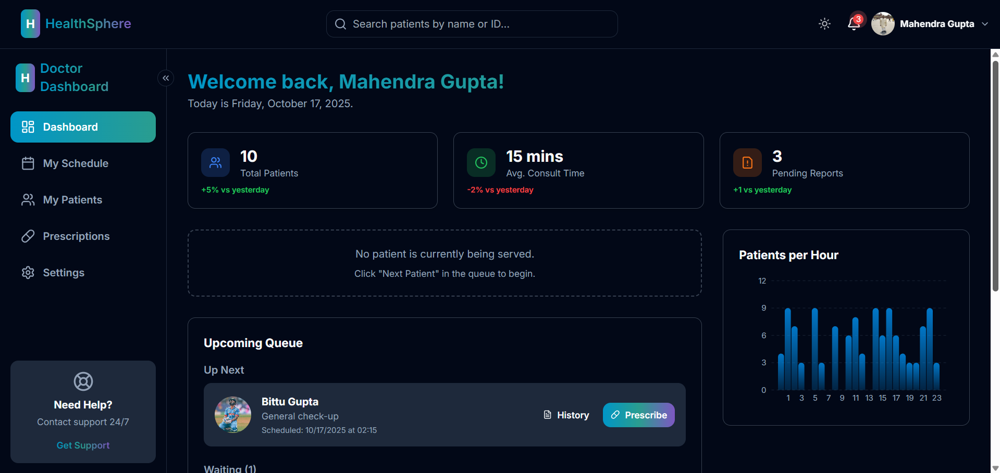
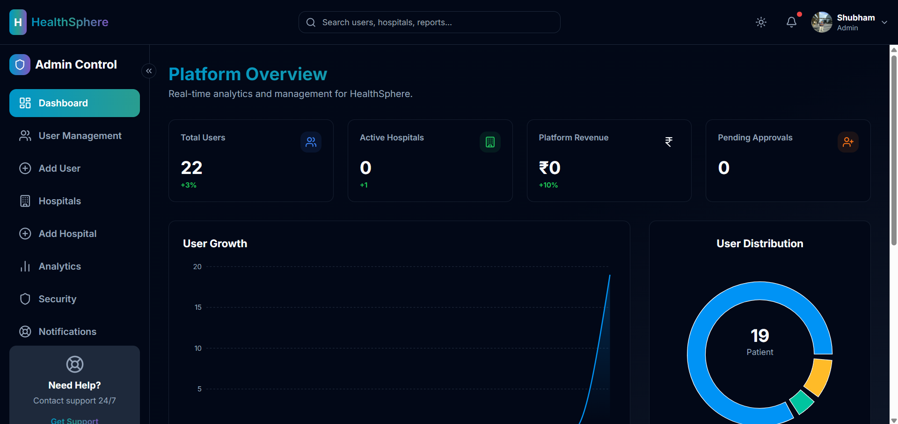

# HealthSphere 🏥

## Project Description 📝
HealthSphere is a comprehensive healthcare management system designed to streamline various aspects of patient, doctor, hospital, and administrative workflows. It aims to provide an efficient and user-friendly platform for managing appointments, medical records, prescriptions, billing, and more. The project leverages modern web technologies to deliver a robust and scalable solution for healthcare providers and patients.

## Features ✨
HealthSphere offers a wide range of features to enhance the healthcare experience:
- **User Authentication & Authorization**: 🔐 Secure login and registration for Patients, Doctors, Hospitals, and Admins with role-based access control.
- **Google OAuth Integration**: 🌐 Seamless sign-up and login using Google accounts.
- **Appointment Management**: 🗓️ Patients can book, view, and manage appointments with doctors. Doctors can manage their schedules and appointment queues.
- **Electronic Health Records (EHR)**: Records 📄 Securely store and access patient health records, including diagnoses, treatments, and medical history.
- **Prescription Management**: 💊 Doctors can write and manage prescriptions. Patients can view their prescribed medications.
- **Billing and Invoicing**: 💸 Manage billing cycles, generate invoices, and track payments for services.
- **Pharmacy/Shop Management**: 🛒 Administration of medical shops, including inventory, sales analytics, and staff management.
- **Donation Centers & Blood Donations**: ❤️ Facilitate blood donation processes by managing donation centers and tracking donor information.
- **Gemini Chatbot Integration**: 🤖 An AI-powered chatbot to assist users with health-related queries and provide quick information.
- **Notifications & Reviews**: 🔔⭐ System-wide notifications for appointments, prescriptions, and other updates. Patients and users can leave reviews for doctors and services.
- **Admin Dashboard & Analytics**: 📊 Comprehensive dashboard for administrators to monitor platform KPIs, user growth, hospital performance, and system alerts.
- **Profile Management**: 👤 Users can view and update their profiles, including personal information and notification preferences.
- **Password Management**: 🔒 Features for changing and resetting forgotten passwords.

## UI Screenshots 📸
Here are some screenshots of the HealthSphere application, showcasing its user interface and key functionalities:

### Login Page

_A clean and intuitive login interface for users to access their accounts._

### Patient Dashboard

_Overview for patients, showing upcoming appointments, health summaries, and quick actions._

### Doctor Dashboard

_Dashboard for doctors, providing access to patient lists, appointment schedules, and prescription writing tools._

### Admin Dashboard

_The administrative control panel, offering insights into system performance, user management, and other crucial metrics._

## Technologies Used 💻

### Backend (Node.js, Express, MongoDB) ⚙️
- **Node.js**: JavaScript runtime environment.
- **Express.js**: Web application framework for Node.js.
- **MongoDB**: NoSQL database for flexible data storage.
- **Mongoose**: MongoDB object data modeling (ODM) for Node.js.
- **bcryptjs**: For password hashing.
- **jsonwebtoken**: For secure authentication using JSON Web Tokens (JWT).
- **cookie-parser**: Parse Cookie header and populate `req.cookies`.
- **cors**: Node.js package for providing a Connect/Express middleware that can be used to enable CORS with various options.
- **dotenv**: Loads environment variables from a `.env` file.
- **express-async-handler**: Simple middleware for handling exceptions inside of async express routes and passing them to your express error handlers.
- **express-session**: Simple session middleware for Express.
- **google-auth-library**: Google Auth Library for Node.js.
- **multer**: Middleware for handling `multipart/form-data`, which is primarily used for uploading files.
- **nodemailer**: Module for Node.js applications to allow easy as cake email sending.
- **passport & passport-google-oauth20**: Authentication middleware for Node.js and Google OAuth 2.0 strategy.
- **twilio**: For SMS and voice communication services.
- **@google/generative-ai**: Google's Generative AI SDK for integrating Gemini chatbot.
- **cloudinary**: Cloud-based image and video management.

### Frontend (React, Vite) 🌐
- **React**: JavaScript library for building user interfaces.
- **Vite**: Next-generation frontend tooling that provides an extremely fast development experience.
- **axios**: Promise-based HTTP client for the browser and Node.js.
- **react-router-dom**: Declarative routing for React.
- **react-toastify**: React notification library.
- **framer-motion**: A production-ready motion library for React.
- **lucide-react**: Beautiful & consistent icon toolkit.
- **@fortawesome/fontawesome-svg-core, @fortawesome/free-brands-svg-icons, @fortawesome/react-fontawesome**: Font Awesome integration for React.
- **recharts**: A composable charting library built with React and D3.
- **tailwindcss**: A utility-first CSS framework.
- **autoprefixer & postcss**: Tools for processing CSS.
- **eslint**: Pluggable JavaScript linter.

## Installation 🚀
To set up and run the HealthSphere project locally, follow these steps:

### Prerequisites ✅
- Node.js (v14 or higher)
- npm (Node Package Manager)
- MongoDB instance (local or cloud-based, e.g., MongoDB Atlas)

### Backend Setup 🖥️
1. **Clone the repository:**
   ```bash
   git clone <repository_url>
   cd HealthSphere/backend
   ```
2. **Install dependencies:**
   ```bash
   npm install
   ```
3. **Environment Variables (.env file):** 🔑
   Create a `.env` file in the `backend` directory with the following variables:
   ```
   PORT=5000
   MONGO_URI=your_mongodb_connection_string
   JWT_SECRET=your_jwt_secret_key
   TWILIO_ACCOUNT_SID=your_twilio_account_sid
   TWILIO_AUTH_TOKEN=your_twilio_auth_token
   TWILIO_PHONE_NUMBER=your_twilio_phone_number
   TWILIO_RECORDED_CALL_URL=your_twilio_recorded_call_url
   GOOGLE_GEMINI_API_KEY=your_google_gemini_api_key
   CLOUDINARY_CLOUD_NAME=your_cloudinary_cloud_name
   CLOUDINARY_API_KEY=your_cloudinary_api_key
   CLOUDINARY_API_SECRET=your_cloudinary_api_secret
   GOOGLE_CLIENT_ID=your_google_client_id
   GOOGLE_CLIENT_SECRET=your_google_client_secret
   ```
   **Note:** Replace placeholder values with your actual credentials. `MONGO_URI` is crucial for database connection.

4. **Start the backend server:** ▶️
   ```bash
   npm start
   # Or for development with hot-reloading:
   npm run dev
   ```
   The backend server will run on `http://localhost:5000` (or the PORT specified in your `.env` file).

### Frontend Setup 🌐
1. **Navigate to the frontend directory:**
   ```bash
   cd ../frontend
   ```
2. **Install dependencies:**
   ```bash
   npm install
   ```
3. **Environment Variables (.env file):** 🔑
   Create a `.env` file in the `frontend` directory with the following variables:
   ```
   VITE_API_BASE_URL=http://localhost:5000
   VITE_GOOGLE_CLIENT_ID=your_google_client_id
   ```
   **Note:** The `VITE_API_BASE_URL` should point to your backend server.

4. **Start the frontend development server:** ▶️
   ```bash
   npm run dev
   ```
   The frontend application will typically open in your browser at `http://localhost:5173`.

## Usage 👨‍💻
Once both the backend and frontend servers are running, you can access the application in your web browser, typically at `http://localhost:5173`.

### Roles and Access 🎭
HealthSphere supports multiple user roles, each with specific access levels:
- **Patient**: 🧑‍⚕️ Can book appointments, view health records, prescriptions, donations, and orders.
- **Doctor**: 🩺 Can manage appointments, write prescriptions, access patient health records, and update schedules.
- **Hospital**: 🏥 (Further integration may be needed to define hospital-specific roles and features).
- **Shop**: 🏪 Can manage inventory, orders, sales analytics, and staff.
- **Admin**: 👑 Full access to the platform, including user management, hospital management, system analytics, and security.

## Contributing 🤝
We welcome contributions to HealthSphere! To contribute, please follow these steps:
1. Fork the repository. 🍴
2. Create a new branch for your feature or bug fix. 🌳
3. Make your changes and ensure they adhere to the project's coding standards. ✍️
4. Write clear and concise commit messages. 💬
5. Submit a pull request with a detailed description of your changes. ⤴️

## License 📜
This project is licensed under the ISC License.

## Contact 📧
For any questions or inquiries, please contact [Your Name/Email/Project Contact].
